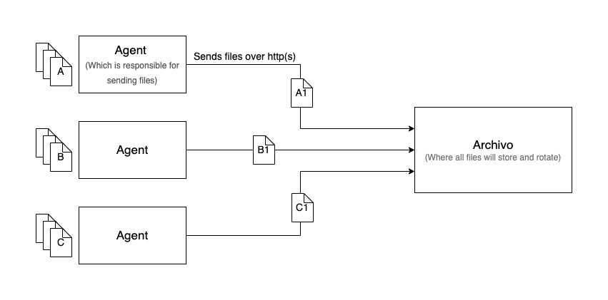
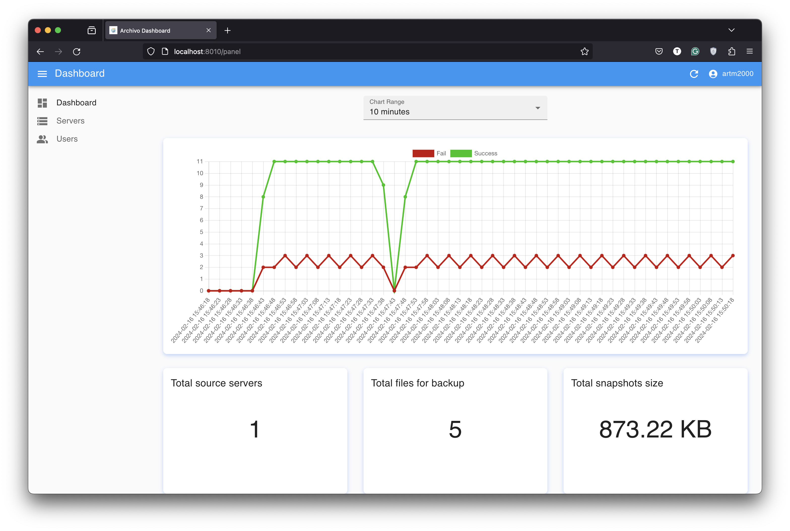
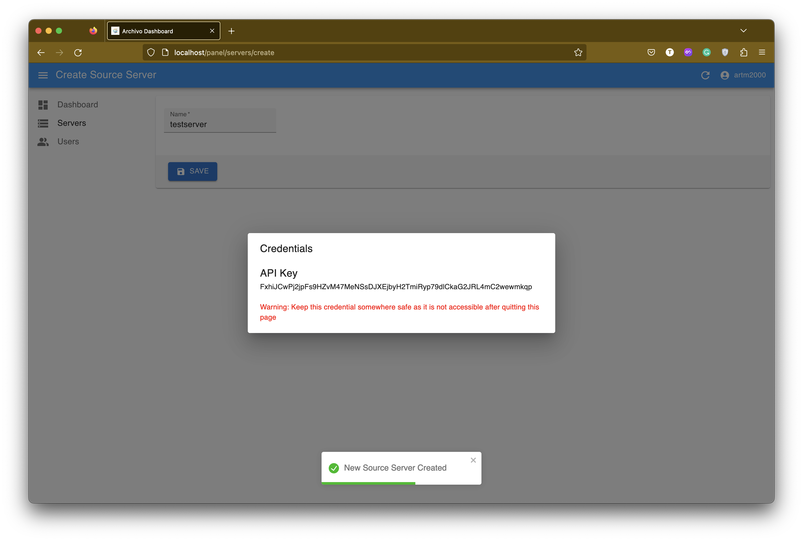
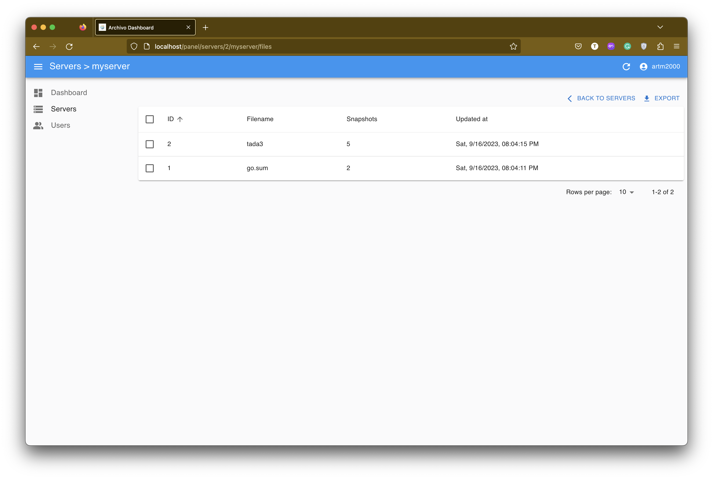
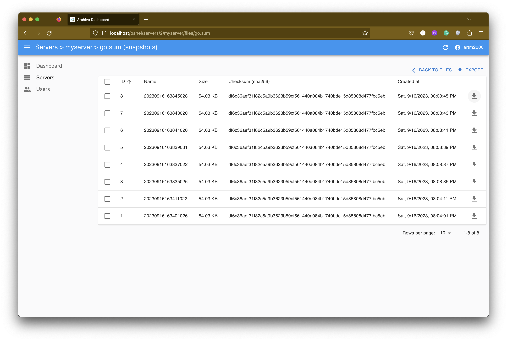
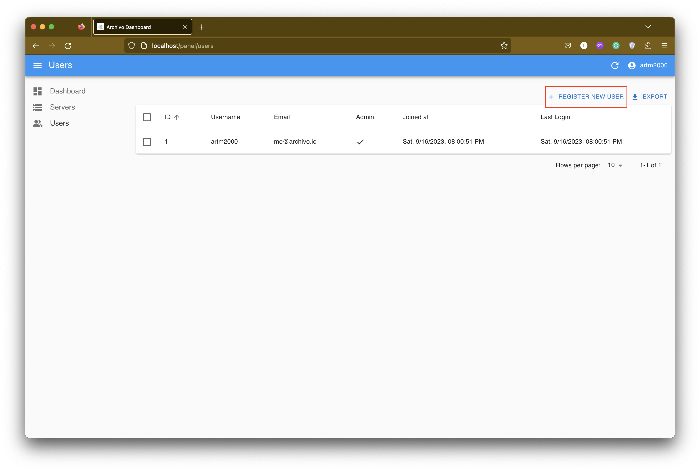
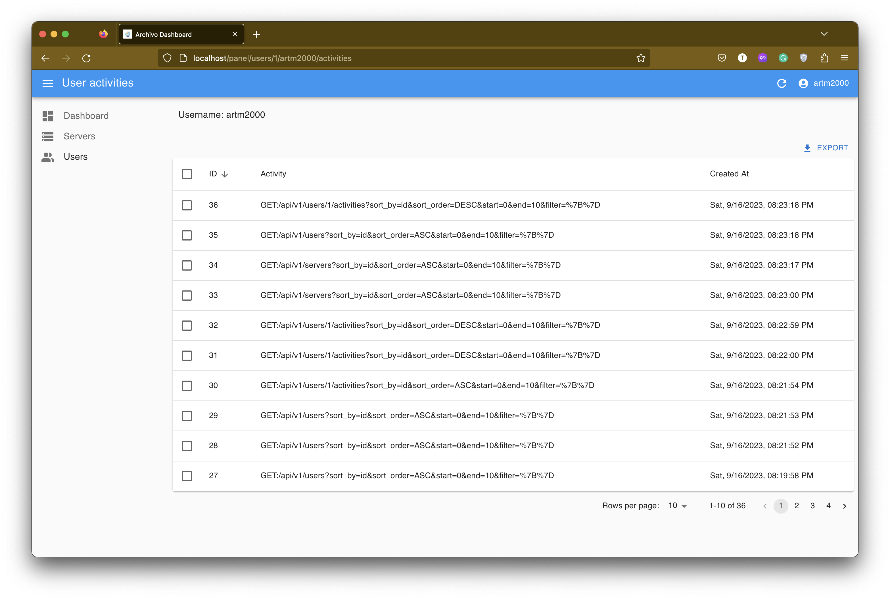

<p align="center">

</p>

# Archivo
Archivo is created to be the final way of __archiving__ files, especially __configuration__ files or any type of documents on servers, by making file __backup management__ easy and useful in case of data loss or disaster occurrence.

- [Archivo](#archivo)
  - [How it works?](#how-it-works)
  - [How to use?](#how-to-use)
    - [Run _archivo_ server](#run-archivo-server)
    - [Run _agent_](#run-agent)
    - [File Management](#file-management)
    - [Register new user](#register-new-user)
    - [User activities](#user-activities)
  - [Support](#support)
  - [Contributing](#contributing)


## How it works?
The design of Archivo is a push mechanism in which any server will push its desired files to one place to maintain snapshots of files by the time. There are two main components that act in this process, first `archivo server` (which we call `archivo` precisely) and second `archivo agent` (which we call `agent`).



`Archivo` is responsible for file backups maintaining and file snapshot access management. Every server that you want to send files from there to backup should be defined in `archivo` and they are called a `source server`. For each `source server`, we have a unique name and API key which will be used to authorize them on every file rotation.

`agent`'s duty is to send the file to `archivo`. It receives a configuration file that defines which file with what interval should be stored on the `archivo` server and how many snapshots should it taken from that file.

> Note: In order to prevent any data loss, the file rotation count decrease is blocked. So you can only increase your file backup rotation count.

## How to use?
For running Archivo, you need first to run `archivo` on a server that should have enough disk space, and any other `agents` can see it through the network. After that, you need to have at least one configured `agent` to store your desired file's snapshots.

### Run _archivo_ server
In order to run _archivo_, you need a running instance of `PostgreSQL` database and a healthy and running instance of `archivo` server. The __postgresql__ database will store any required data with archivo needs.

There are two ways of running `archivo` server:

1. Running with `docker-compose`. You can use [docker-compose.yaml](./docker-compose.yaml) which will use __archivo docker image__ or using [docker-compose.local.yaml](./docker-compose.local.yaml) which will require to clone the project and build your docker image from source.
2. Run the binary version. For running as a binary _archivo server_ you need first to download the proper binary build of the project that matches your target operating system (look at [release page](https://github.com/ARTM2000/archivo/releases) to download compressed binaries) and have a running version of `PostgreSQL` on the server.

After you do one of the options, you need to prepare your configuration file. By default, `archivo` tries to read the configuration file from `${HOME}/.archivo.yaml` ( If you run it with docker, the default configuration path is `/home/archivo/.archivo.yaml` ). 

You can find an example of `.archivo.yaml` [here](./example/server/.archivo.yaml).

After your configuration is ready, you should run `archivo` server by running the following:
```bash
# If you set your config file at ${HOME}/.archivo.yaml
./archivo

# If you set your config file elsewhere, pass the path of the config file
./archivo -c /absolute/path/config/.archivo.yml
```

You can validate your configuration with the following command:
```bash
# If you set your config file at ${HOME}/.archivo.yaml
./archivo validate

# If you set your config file elsewhere, pass the path of the config file
./archivo validate -c /absolute/path/config/.archivo.yml
```

If everything is ok, your `archivo` server starts listening on `0.0.0.0:<PORT>` which PORT is the port number that you defined in the config file. By default, it starts listening on `8010`. 

The next step is to open the Archivo listening address and register the _Admin user_ in the Archivo panel.


After Register and Login, you see the dashboard page which is the home page of the Archivo panel


By going to the servers section and creating a new `source server`, you will get an __API KEY__ which will be used for _agent_ OAuth to send files. __IMPORTANT__, this _API KEY_ is not accessible anymore. So, keep it somewhere safe.


Now you are ready to set up your `agent`.


### Run _agent_
In order to run _agent server_ you need first to download the proper binary build of the project that matches your target host (look at [release page](https://github.com/ARTM2000/archivo/releases) to download compressed binaries).

After you get the binary file, you need to prepare your configuration file. By default, `agent` tries to read the configuration file from `${HOME}/.agent.yaml`. You can find an example of `.agent.yaml` [here](./example/agent/.agent.yaml).

You need to place your registered source server _name_ to _agent_name_ and _API KEY_ to _agent_key_ in the configuration file that you got from the last section.

After your configuration is ready, you should run `agent` by running:
```bash
# If you set your config file at ${HOME}/.agent1.yaml
./agent

# If you set your config file elsewhere, pass the path of the config file
./agent -c /absolute/path/config/.agent.yml
```

You can validate your configuration with the following command:
```bash
# If you set your config file at ${HOME}/.agent1.yaml
./agent validate

# if you set your config file elsewhere, pass the path of config file
./agent validate -c /absolute/path/config/.agent.yml
```

If everything goes successful, it will start to send files to archivo server.

### File Management
In Archivo Panel, by click on each source server in the list you can see your files as below:


By selecting each file, you can access the list of file's snapshots and download any as you want:


On each row, you can see this information for each snapshot that explained as below:
| Fields     | Description                                                                                              |
| ---------- | -------------------------------------------------------------------------------------------------------- |
| Name       | Each snapshot will name by the combination of date and time                                              |
| Size       | Snapshot size on disk                                                                                    |
| Checksum   | Snapshot checksum that is file sha256 hash and can be use to determine that file has been changed or not |
| Created at | Time that snapshot created                                                                               |

### Register new user
Currently, only admin user can register new user. Each user has an initial password that admin sets for them. At first login, each non-admin user will asked for password change and that new password will be use the user in panel.


### User activities
The only difference between admin and non-admin users is registering new user and listing user activities in panel. 


## Support
Feel free to [open an issue](https://github.com/artm2000/archivo/issues/new) if you have questions, run into bugs, or have a feature request.

## Contributing
Contributions are welcome!


