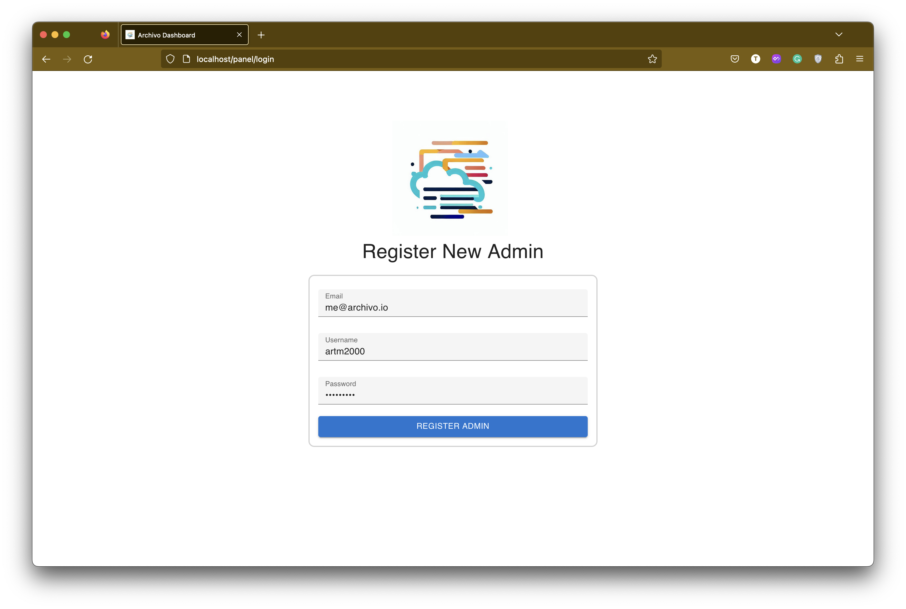

<p style="text-align: center; font-size: 40px"><strong>Archivo</strong></p>

# Archivo
Archivo is created to be the final way of __archiving__ files, specially __configuration__ file or any type of documents on servers, by making file __backup management__ easy and useful in case of data loss or disaster occurrence.

- [Archivo](#archivo)
  - [How it works?](#how-it-works)
  - [How to use?](#how-to-use)
    - [Run _archivo_ server](#run-archivo-server)
    - [Run _agent_](#run-agent)


## How it works?
The design of archivo is on push mechanism which any server will push its desired files to one place to maintain snapshot of files by the time. There is two main components that act in this process, first `archivo server` (which we call `archivo` precisely) and second `archivo agent` (which we call `agent`).


`archivo` is responsible for file backups maintaining and file snapshot access management. Every servers that you want to send files from there to backup should be defined in `archivo` and they are called as `source server`. For each `source server` we have unique name and api key which will be use to authorized them on every file rotate.

`agent`'s duty is to send file to `archivo`. It receives a configuration file that defines which file with what interval should be stored to `archivo` server and how many snapshot should it takes from that file.

> Note: In order to prevent any data loss, file rotation count decreasing is blocked. So you can only increase your files backup rotation count.

## How to use?
For running archivo, you need first to run `archivo` on your server which should have enough disk space and any other `agent`s can see it through network. After that, you need to have at least one configured `agent` to store your desired file's snapshots.

### Run _archivo_ server
In order to run _archivo_, you need a running instance of `postgresql` data base and a healthy and running instance of `archivo` server. The __postgresql__ database will be used to store any required data with archivo needs.

There are two ways of running `archivo` server:

1. Running with `docker-compose`. You can use [docker-compose.yaml](./docker-compose.yaml) which will use __archivo docker image__ or using [docker-compose.local.yaml](./docker-compose.local.yaml) which will require to clone the project and build your docker image from source.
2. Run binary version. For running as binary _archivo server_ you need first to download proper binary build of project that matches you target operating system (look at [release page](https://github.com/ARTM2000/archivo/releases) to download compressed binaries) and have a running version of `postgresql` on the server.

After you did one of the options, you need to prepare your configuration file. By default, `archivo` tries to read configuration file from `${HOME}/.archivo.yaml` ( If you run it with docker, the default configuration path is `/home/archivo/.archivo.yaml` ). 

You can find an example of `.archivo.yaml` [here](./example/server/.archivo.yaml).

After your configuration is ready, you should run `archivo` server by running:
```bash
# if you set your config file at ${HOME}/.archivo.yaml
./archivo

# if you set your config file elsewhere, pass the path of config file
./archivo -c /absolute/path/config/.archivo.yml
```

You can validate your configuration with following command:
```bash
# if you set your config file at ${HOME}/.archivo.yaml
./archivo validate

# if you set your config file elsewhere, pass the path of config file
./archivo validate -c /absolute/path/config/.archivo.yml
```

If everything was ok, your `archivo` server starts listening on `0.0.0.0:<PORT>` which PORT is your port number that you defined in config file. By default it starts listening on `8010`. 

Next step is to open archivo listening address and register _Admin user_ in the archivo panel.


After Register and Login, you see dashboard page which is home page of archivo panel


By going to servers section and creating new `source server`, you will get an __API KEY__ which will be use for _agent_ oauth to send files. __IMPORTANT__, this _API KEY_ is not accessible anymore. So, keep it somewhere safe.


Now you are ready to setup you `agent`.


### Run _agent_
In order to run _agent server_ you need first to download proper binary build of project that matches you target host (look at [release page](https://github.com/ARTM2000/archivo/releases) to download compressed binaries).

After you got the binary file, you need to have prepare your configuration file. By default, `agent` tries to read configuration file from `${HOME}/.agent.yaml`. You can find an example of `.agent.yaml` [here](./example/agent/.agent.yaml).

You need to place your registered source server _name_ to _agent_name_ and _API KEY_ to _agent_key_ in configuration file that you got from last section.

After your configuration is ready, you should run `agent` by running:
```bash
# if you set your config file at ${HOME}/.agent1.yaml
./agent

# if you set your config file elsewhere, pass the path of config file
./agent -c /absolute/path/config/.agent.yml
```

You can validate your configuration with following command:
```bash
# if you set your config file at ${HOME}/.agent1.yaml
./agent validate

# if you set your config file elsewhere, pass the path of config file
./agent validate -c /absolute/path/config/.agent.yml
```

if everything goes successful, it will start to send files to archivo server
